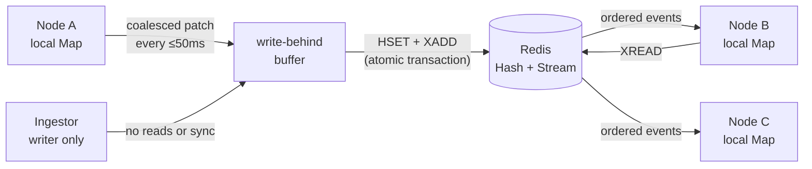

<p align="center">
  
</p>

<p align="center">
  A tiny, typed, self-synchronizing <code>Map</code> backed by Redis.
</p>

<p align="center">
  <a href="https://www.npmjs.com/package/redis-dist-map"></a>
  <a href="https://github.com/alzalabany/redis-dist-map/actions/workflows/ci.yml"></a>
  <a href="./LICENSE"></a>
  <a href="https://bundlephobia.com/package/redis-dist-map"></a>
</p>

<p align="center">
  <a href="https://alzalabany.github.io/redis-dist-map/"><strong>Explore the project →</strong></a>
</p>

---

`redis-dist-map` gives every Node.js process an in-memory, synchronous-to-read
view of the same Redis-backed map. Write on one instance; the others update
through a Redis Stream.

```ts
import Redis from "ioredis";
import { createDistributedMap } from "redis-dist-map";

const redis = new Redis(process.env.REDIS_URL);

const flags = await createDistributedMap<boolean>("feature-flags", {
  client: redis,
});

const unsubscribe = flags.onChange("new-checkout", (enabled, change) => {
  console.log(enabled, change.source);
});

flags.set("new-checkout", true);

// Reads and writes touch local memory immediately.
console.log(flags.get("new-checkout")); // true
console.log(flags.size);                // 1

// Establish an explicit durability boundary before shutdown.
await flags.flush();
unsubscribe();
await flags.destroy();
await redis.quit();
```

## Why it feels familiar

| JavaScript `Map` | `redis-dist-map` | Notes |
|---|---|---|
| `map.get(key)` | `map.get(key)` | Synchronous local read |
| `map.has(key)` | `map.has(key)` | Synchronous local read |
| `map.set(key, value)` | `map.set(key, value)` | Synchronous local write |
| `map.delete(key)` | `map.delete(key)` | Synchronous local write |
| `map.clear()` | `map.clear()` | Synchronous local write |
| iteration | iteration | Entries come from local memory |

It is a good fit for shared configuration, feature flags, presence metadata,
market prices, lightweight registries, and high-frequency state where processes
need fast local access and Redis is the source of truth.

## Use case 1: live prices without Redis on every request

When prices move 100 times a second, your system should not turn every update
or customer read into another Redis round trip.

Let one process absorb the firehose. Every API instance gets the latest price
in its own memory and reads it synchronously.

```ts
type PriceTick = {
  ask: number;
  bid: number;
  volume: number;
};
```

### Server 1: absorb the market feed

```ts
import Redis from "ioredis";
import { createDistributedMapWriter } from "redis-dist-map";

const redis = new Redis(process.env.REDIS_URL);
const writer = createDistributedMapWriter<PriceTick>("market:prices", {
  client: redis,
});

marketFeed.on("tick", ({ symbol, ask, bid, volume }) => {
  writer.set(symbol, { ask, bid, volume });
});
```

The writer is built for the hot side of the system: no snapshot, no local read
cache, and no Stream listener. Repeated updates for the same symbol collapse
into the latest value and publish in one atomic Redis patch every 50ms by
default.

### Server 2: serve prices from memory

```ts
import Redis from "ioredis";
import { createDistributedMap } from "redis-dist-map";

const redis = new Redis(process.env.REDIS_URL);
const tickers = await createDistributedMap<PriceTick>("market:prices", {
  client: redis,
});

// Synchronous local read. XREAD keeps this Map current in the background.
const latestAsk = tickers.get("AAPL")?.ask;
```

Server 2 loads the current Hash on startup, then applies incoming Stream patches
automatically. Your pricing endpoint stays simple: `tickers.get(symbol)` is a
local `Map` read, even while Server 1 keeps publishing the feed.

**The payoff:** ingest once, fan out automatically, and keep Redis off the
customer-facing hot path.

## Use case 2: miss once, hit everywhere

Put the same cache-aside route on every API instance. Whichever instance sees a
key first loads it from the database and fills the cache. The other instances
receive that response automatically and serve later requests from their own
memory.

```ts
import { createDistributedMap } from "redis-dist-map";

type TickerPage = {
  title: string;
  summary: string;
};

const tickerCache = await createDistributedMap<TickerPage>(
  "cache:ticker-pages",
  { client: redis },
);

app.get("/ticker/:name", async (request) => {
  const { name } = request.params as { name: string };
  const cached = tickerCache.get(name);

  if (cached !== undefined) return cached;

  const ticker = await db.getWikipage(name);
  tickerCache.set(name, ticker);
  return ticker;
});
```

Imagine the first `/ticker/AAPL` request lands on API instance 1. It misses,
loads the page, and calls `set`. The patch reaches instances 2 through N in the
background. The next `/ticker/AAPL` request can land anywhere and return from a
local `Map`—no database query and no Redis round trip on the request path.

**The payoff:** your load balancer can send traffic anywhere while every
instance benefits from work already done by another.

This is a shared cache, not a distributed lock. Simultaneous requests for a
brand-new key can still miss before the first value propagates; use single-flight
or locking as well when duplicate cold loads must be prevented.

Cache lifetime is application-controlled: refresh with `set` or invalidate with
`delete`. `historyMs` trims Stream history; it is not a cache TTL.

## Use case 3: one rate limit across every API instance

Per-process counters break as soon as a load balancer sends the same user to a
different server. A shared counter makes every API instance enforce the same
limit without trying to synchronize an in-memory value.

```ts
import { createSharedCounter } from "redis-dist-map";

const requests = createSharedCounter("rate-limit:api", {
  client: redis,
  ttlMs: 60_000,
});

app.use(async (req, res, next) => {
  const userId = req.user.id;
  const current = await requests.inc(userId);

  if (current > 100) {
    res.status(429).send({ error: "RATE_LIMITED", ok: false });
    return;
  }

  next();
});
```

Every `inc()` goes directly to Redis. A Lua script increments the user's key
and starts its expiry together, so concurrent requests cannot lose increments
or create a counter without a TTL. The window starts on the first request and
later increments do not extend it.

**The payoff:** request 101 is rejected no matter which API instance receives
it.

This is a fixed-window limiter. It is intentionally separate from the
write-behind map: rate-limit decisions require an awaited, atomic Redis result
on every request.

## How it works



Local mutations are coalesced by key for up to `flushIntervalMs` and persisted
as one patch. The patch updates the Redis Hash and appends a Redis Stream event
in one transaction. Every readable map keeps a blocking stream reader on a
duplicated ioredis connection; write-only publishers skip that work entirely.

The Stream retains ten seconds of patches by default using `XADD MINID`. Each
atomic patch increments a map revision. Readers reload the Hash only when a
revision gap proves that trimmed events were missed or when an event cannot be
applied.

### Consistency model

- A local write is immediately visible to its caller but is not yet durable.
- `flush()` makes every mutation queued before the call durable and broadcast.
- Automatic flushes run at most `flushIntervalMs` after the first pending write.
- Updates to the same key inside one window are coalesced to the latest value.
- Other healthy instances normally converge within the flush interval plus
  Redis/network latency.
- Change listeners fire immediately for local mutations and after application
  for remote or snapshot-recovery mutations.
- Events are applied in revision order and duplicate events are ignored.
- A skipped revision automatically reloads the authoritative Hash; healthy
  readers do not poll snapshots.
- An abrupt process crash can lose up to one flush window of local mutations.
- This is not a linearizable distributed data structure: a remote instance can
  briefly return its previous value, and concurrent writers resolve in Redis
  arrival order.

## Installation

```bash
npm install redis-dist-map ioredis
```

Requires Node.js 18+, ioredis 5+, and Redis 6.2+ (`XADD MINID`).

Install a specific GitHub release without using the npm registry:

```bash
npm install git+https://github.com/alzalabany/redis-dist-map.git#v0.4.0
```

Git installs build the package locally during installation. Add `ioredis` to
the consuming project.

## API

### `createSharedCounter(name, options)`

Creates an atomic Redis-backed counter namespace. Increments go directly to
Redis and are never buffered or served from local memory.

```ts
import { createSharedCounter } from "redis-dist-map";

const attempts = createSharedCounter("rate-limit", {
  client: redis,
  ttlMs: 60_000,
});

const current = await attempts.inc(userId);
if (current > 100) {
  res.status(429).send({ error: "RATE_LIMITED", ok: false });
}
```

When `ttlMs` is configured, the expiry starts atomically with the first
increment and later increments do not extend it. Omit `ttlMs` for a persistent
counter. Each logical key is stored as its own Redis string, so expiration is
independent per user or resource.

```ts
type SharedCounterOptions = {
  client: Redis;
  ttlMs?: number;
};
```

This is a fixed-window counter. Unlike distributed map mutations, every
`inc()` is an awaited Redis round trip so concurrent increments cannot be
coalesced or lost.

### `createDistributedMap(name, options)`

Creates the initial snapshot, starts the update listener, and resolves with a
`DistributedMap<T>`.

```ts
type DistributedMapOptions<T> = {
  client: Redis;
  serialize?: (value: T) => string;
  deserialize?: (value: string) => T;
  blockTimeoutMs?: number;
  flushIntervalMs?: number;       // default: 50
  historyMs?: number;             // default: 10_000
  onError?: (error: unknown) => void;
};
```

```ts
type DistributedMapChange<T> = {
  key: string;
  operation: "set" | "delete";
  value: T | undefined;
  previousValue: T | undefined;
  source: "local" | "remote" | "synchronize";
};
```

JSON is used by default. Bring your own codec for values such as `Date`, `BigInt`,
or binary data:

```ts
const deadlines = await createDistributedMap<Date>("deadlines", {
  client: redis,
  serialize: (date) => date.toISOString(),
  deserialize: (value) => new Date(value),
});
```

### `createDistributedMapWriter(name, options)`

Creates a synchronous, write-only publisher for processes that ingest data but
never read it:

```ts
import Redis from "ioredis";
import { createDistributedMapWriter } from "redis-dist-map";

const redis = new Redis(process.env.REDIS_URL);
const writer = createDistributedMapWriter<Tick>("prices", {
  client: redis,
  flushIntervalMs: 50,
});

writer.set("XAUUSD.m", tick);

await writer.flush();
await writer.destroy();
await redis.quit();
```

The writer opens no duplicated connection, loads no Hash snapshot, keeps no
local readable Map, and receives no Redis Stream traffic. It retains the same
write coalescing, atomic Hash + Stream transaction, retention, custom
serialization, automatic flushing, and explicit `flush()` durability boundary.

```ts
type DistributedMapWriterOptions<T> = {
  client: Redis;
  serialize?: (value: T) => string;
  flushIntervalMs?: number; // default: 50
  historyMs?: number;       // default: 10_000
  onError?: (error: unknown) => void;
};
```

Its deliberately small API is `set`, `delete`, `clear`, `flush`, and `destroy`.
`delete()` returns `void`: without loading remote state, a writer cannot know
whether the key previously existed.

### `set`, `delete`, and `clear`

Mutations update local memory synchronously and enter the write-behind buffer.
They do not wait for Redis:

```ts
prices.set("AAPL", { bid: 213.41, ask: 213.43 });
prices.set("AAPL", { bid: 213.42, ask: 213.44 });

// Only the latest AAPL quote is included in the next patch.
```

### `flush()`

Immediately persists and publishes every mutation queued before the call.
Flushes are serialized, and mutations arriving during a flush remain in the
next buffer.

```ts
await prices.flush();
```

### `onChange()`

Subscribe to one key:

```ts
const unsubscribe = prices.onChange("XAUUSD.m", (tick, change) => {
  if (change.operation === "delete") {
    console.log("XAUUSD.m was removed");
    return;
  }

  console.log("New tick", tick, change.source);
});

// Safe to call more than once.
unsubscribe();
```

Or observe every key:

```ts
const unsubscribe = prices.onChange((change) => {
  console.log(change.key, change.value, change.source);
});
```

Subscriptions do not emit an initial value; call `get()` or iterate the map for
the initial snapshot. A listener fires only when the serialized value changes
or an existing key is deleted. Listener exceptions are isolated and forwarded
to `onError`.

### Lifecycle

Call `flush()` during graceful shutdown, then call `destroy()`. Destroy stops
the timers/listener and closes only the duplicated connection owned by the map;
it intentionally does not flush pending mutations.

```ts
process.once("SIGTERM", async () => {
  await flags.flush();
  await flags.destroy();
  await redis.quit();
});
```

## Operational notes

- The map uses three keys: `<name>` for the Hash, `<name>:stream` for events,
  and `<name>:revision` for gap detection.
- Stream patches are trimmed by age on every flush. During a completely idle
  period, the last retained patch remains until another flush performs trimming.
- The default 50ms buffer emits at most 20 transactions per second per active
  map or writer, regardless of how many same-key updates are coalesced inside
  each window.
- `historyMs` uses the local clock to derive Redis Stream ID cutoffs; keep
  application and Redis host clocks synchronized.
- Values must serialize to a string. Default JSON serialization rejects
  `undefined`, functions, and symbols.
- Use a unique, namespaced map name such as `my-app:prod:feature-flags`.
- `onError` receives recoverable listener errors. An exception thrown by the
  callback is isolated from the synchronization loop.

## Development

The tests launch an isolated local `redis-server`.

```bash
npm install
npm test
npm run check
npm run build
```

See [CONTRIBUTING.md](./CONTRIBUTING.md) for the complete workflow.

## License

MIT © [alzalabany](https://github.com/alzalabany)
