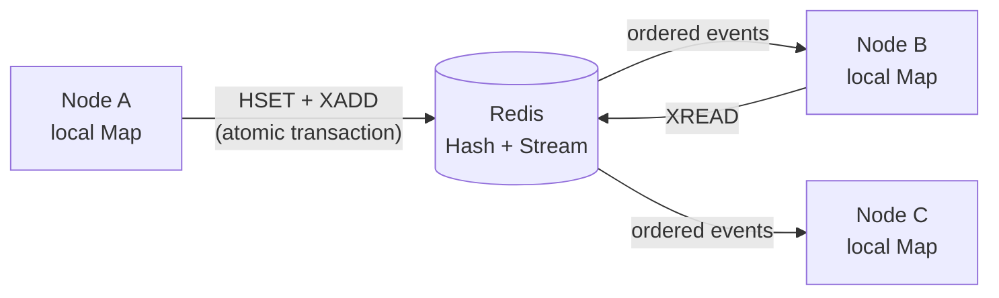

<p align="center">
  
</p>

<p align="center">
  A tiny, typed, self-synchronizing <code>Map</code> backed by Redis.
</p>

<p align="center">
  <a href="https://www.npmjs.com/package/redis-dist-map"></a>
  <a href="https://github.com/alzalabany/redis-dist-map/actions/workflows/ci.yml"></a>
  <a href="./LICENSE"></a>
  <a href="https://bundlephobia.com/package/redis-dist-map"></a>
</p>

<p align="center">
  <a href="https://alzalabany.github.io/redis-dist-map/"><strong>Explore the project →</strong></a>
</p>

---

`redis-dist-map` gives every Node.js process an in-memory, synchronous-to-read
view of the same Redis-backed map. Write on one instance; the others update
through a Redis Stream.

```ts
import Redis from "ioredis";
import { createDistributedMap } from "redis-dist-map";

const redis = new Redis(process.env.REDIS_URL);

const flags = await createDistributedMap<boolean>("feature-flags", {
  client: redis,
});

await flags.set("new-checkout", true);

// Map-like reads never make a network round-trip.
console.log(flags.get("new-checkout")); // true
console.log(flags.size);                // 1

await flags.destroy();
await redis.quit();
```

## Why it feels familiar

| JavaScript `Map` | `redis-dist-map` | Notes |
|---|---|---|
| `map.get(key)` | `map.get(key)` | Synchronous local read |
| `map.has(key)` | `map.has(key)` | Synchronous local read |
| `map.set(key, value)` | `await map.set(key, value)` | Redis is committed first |
| `map.delete(key)` | `await map.delete(key)` | Resolves to `boolean` |
| `map.clear()` | `await map.clear()` | Broadcast to every instance |
| iteration | iteration | Entries come from local memory |

It is a good fit for shared configuration, feature flags, presence metadata,
lightweight registries, and read-heavy state where processes need fast local
access and Redis is the source of truth.

## How it works



Each write updates a Redis Hash and appends an event to a Redis Stream in one
transaction. Every instance keeps a blocking stream reader on a duplicated
ioredis connection. Startup and manual synchronization load the hash and stream
cursor atomically, so reads can stay entirely local.

### Consistency model

- A completed write is durable in Redis and immediately visible to its caller.
- Other healthy instances converge asynchronously, normally in a few milliseconds.
- Events are applied in Redis Stream ID order and duplicate events are ignored.
- `synchronize()` reloads an authoritative snapshot after a suspected gap.
- This is not a linearizable distributed data structure: a remote instance can
  briefly return its previous local value while an event is in flight.

## Installation

```bash
npm install redis-dist-map ioredis
```

Requires Node.js 18+, ioredis 5+, and Redis 5+ (Redis Streams).

## API

### `createDistributedMap(name, options)`

Creates the initial snapshot, starts the update listener, and resolves with a
`DistributedMap<T>`.

```ts
type DistributedMapOptions<T> = {
  client: Redis;
  serialize?: (value: T) => string;
  deserialize?: (value: string) => T;
  blockTimeoutMs?: number;
  onError?: (error: unknown) => void;
};
```

JSON is used by default. Bring your own codec for values such as `Date`, `BigInt`,
or binary data:

```ts
const deadlines = await createDistributedMap<Date>("deadlines", {
  client: redis,
  serialize: (date) => date.toISOString(),
  deserialize: (value) => new Date(value),
});
```

### Lifecycle

Call `destroy()` when an instance shuts down. It stops the listener and closes
only the duplicated connection owned by the map; your original Redis client
remains yours.

```ts
process.once("SIGTERM", async () => {
  await flags.destroy();
  await redis.quit();
});
```

## Operational notes

- The map uses two keys: `<name>` for the hash and `<name>:stream` for events.
- Stream history is not trimmed automatically. Apply a retention policy only
  after considering how long disconnected consumers may need to catch up.
- Values must serialize to a string. Default JSON serialization rejects
  `undefined`, functions, and symbols.
- Use a unique, namespaced map name such as `my-app:prod:feature-flags`.
- `onError` receives recoverable listener errors. An exception thrown by the
  callback is isolated from the synchronization loop.

## Development

The tests launch an isolated local `redis-server`.

```bash
npm install
npm test
npm run check
npm run build
```

See [CONTRIBUTING.md](./CONTRIBUTING.md) for the complete workflow.

## License

MIT © [alzalabany](https://github.com/alzalabany)
