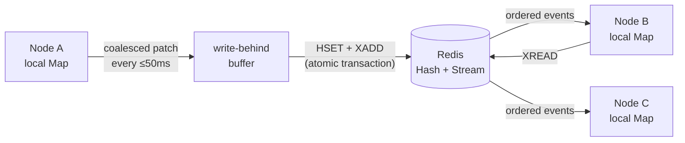

<p align="center">
  
</p>

<p align="center">
  A tiny, typed, self-synchronizing <code>Map</code> backed by Redis.
</p>

<p align="center">
  <a href="https://www.npmjs.com/package/redis-dist-map"></a>
  <a href="https://github.com/alzalabany/redis-dist-map/actions/workflows/ci.yml"></a>
  <a href="./LICENSE"></a>
  <a href="https://bundlephobia.com/package/redis-dist-map"></a>
</p>

<p align="center">
  <a href="https://alzalabany.github.io/redis-dist-map/"><strong>Explore the project →</strong></a>
</p>

---

`redis-dist-map` gives every Node.js process an in-memory, synchronous-to-read
view of the same Redis-backed map. Write on one instance; the others update
through a Redis Stream.

```ts
import Redis from "ioredis";
import { createDistributedMap } from "redis-dist-map";

const redis = new Redis(process.env.REDIS_URL);

const flags = await createDistributedMap<boolean>("feature-flags", {
  client: redis,
});

const unsubscribe = flags.onChange("new-checkout", (enabled, change) => {
  console.log(enabled, change.source);
});

flags.set("new-checkout", true);

// Reads and writes touch local memory immediately.
console.log(flags.get("new-checkout")); // true
console.log(flags.size);                // 1

// Establish an explicit durability boundary before shutdown.
await flags.flush();
unsubscribe();
await flags.destroy();
await redis.quit();
```

## Why it feels familiar

| JavaScript `Map` | `redis-dist-map` | Notes |
|---|---|---|
| `map.get(key)` | `map.get(key)` | Synchronous local read |
| `map.has(key)` | `map.has(key)` | Synchronous local read |
| `map.set(key, value)` | `map.set(key, value)` | Synchronous local write |
| `map.delete(key)` | `map.delete(key)` | Synchronous local write |
| `map.clear()` | `map.clear()` | Synchronous local write |
| iteration | iteration | Entries come from local memory |

It is a good fit for shared configuration, feature flags, presence metadata,
market prices, lightweight registries, and high-frequency state where processes
need fast local access and Redis is the source of truth.

## How it works



Local mutations are coalesced by key for up to `flushIntervalMs` and persisted
as one patch. The patch updates the Redis Hash and appends a Redis Stream event
in one transaction. Every instance keeps a blocking stream reader on a
duplicated ioredis connection.

The Stream retains ten seconds of patches by default using `XADD MINID`.
Periodic Hash snapshots repair replicas that were offline longer than the
retention window.

### Consistency model

- A local write is immediately visible to its caller but is not yet durable.
- `flush()` makes every mutation queued before the call durable and broadcast.
- Automatic flushes run at most `flushIntervalMs` after the first pending write.
- Updates to the same key inside one window are coalesced to the latest value.
- Other healthy instances normally converge within the flush interval plus
  Redis/network latency.
- Change listeners fire immediately for local mutations and after application
  for remote or snapshot-recovery mutations.
- Events are applied in Redis Stream ID order and duplicate events are ignored.
- Periodic `synchronize()` calls reload the authoritative Hash after trimmed gaps.
- An abrupt process crash can lose up to one flush window of local mutations.
- This is not a linearizable distributed data structure: a remote instance can
  briefly return its previous value, and concurrent writers resolve in Redis
  arrival order.

## Installation

```bash
npm install redis-dist-map ioredis
```

Requires Node.js 18+, ioredis 5+, and Redis 6.2+ (`XADD MINID`).

## API

### `createDistributedMap(name, options)`

Creates the initial snapshot, starts the update listener, and resolves with a
`DistributedMap<T>`.

```ts
type DistributedMapOptions<T> = {
  client: Redis;
  serialize?: (value: T) => string;
  deserialize?: (value: string) => T;
  blockTimeoutMs?: number;
  flushIntervalMs?: number;       // default: 50
  historyMs?: number;             // default: 10_000
  synchronizeIntervalMs?: number; // default: historyMs / 2
  onError?: (error: unknown) => void;
};
```

```ts
type DistributedMapChange<T> = {
  key: string;
  operation: "set" | "delete";
  value: T | undefined;
  previousValue: T | undefined;
  source: "local" | "remote" | "synchronize";
};
```

JSON is used by default. Bring your own codec for values such as `Date`, `BigInt`,
or binary data:

```ts
const deadlines = await createDistributedMap<Date>("deadlines", {
  client: redis,
  serialize: (date) => date.toISOString(),
  deserialize: (value) => new Date(value),
});
```

### `set`, `delete`, and `clear`

Mutations update local memory synchronously and enter the write-behind buffer.
They do not wait for Redis:

```ts
prices.set("AAPL", { bid: 213.41, ask: 213.43 });
prices.set("AAPL", { bid: 213.42, ask: 213.44 });

// Only the latest AAPL quote is included in the next patch.
```

### `flush()`

Immediately persists and publishes every mutation queued before the call.
Flushes are serialized, and mutations arriving during a flush remain in the
next buffer.

```ts
await prices.flush();
```

### `onChange()`

Subscribe to one key:

```ts
const unsubscribe = prices.onChange("XAUUSD.m", (tick, change) => {
  if (change.operation === "delete") {
    console.log("XAUUSD.m was removed");
    return;
  }

  console.log("New tick", tick, change.source);
});

// Safe to call more than once.
unsubscribe();
```

Or observe every key:

```ts
const unsubscribe = prices.onChange((change) => {
  console.log(change.key, change.value, change.source);
});
```

Subscriptions do not emit an initial value; call `get()` or iterate the map for
the initial snapshot. A listener fires only when the serialized value changes
or an existing key is deleted. Listener exceptions are isolated and forwarded
to `onError`.

### Lifecycle

Call `flush()` during graceful shutdown, then call `destroy()`. Destroy stops
the timers/listener and closes only the duplicated connection owned by the map;
it intentionally does not flush pending mutations.

```ts
process.once("SIGTERM", async () => {
  await flags.flush();
  await flags.destroy();
  await redis.quit();
});
```

## Operational notes

- The map uses two keys: `<name>` for the hash and `<name>:stream` for events.
- Stream patches are trimmed by age on every flush. During a completely idle
  period, the last retained patch remains until another flush performs trimming.
- The default 50ms buffer emits at most 20 transactions per second per active
  map, regardless of how many same-key updates are coalesced inside each window.
- `historyMs` uses the local clock to derive Redis Stream ID cutoffs; keep
  application and Redis host clocks synchronized.
- Values must serialize to a string. Default JSON serialization rejects
  `undefined`, functions, and symbols.
- Use a unique, namespaced map name such as `my-app:prod:feature-flags`.
- `onError` receives recoverable listener errors. An exception thrown by the
  callback is isolated from the synchronization loop.

## Development

The tests launch an isolated local `redis-server`.

```bash
npm install
npm test
npm run check
npm run build
```

See [CONTRIBUTING.md](./CONTRIBUTING.md) for the complete workflow.

## License

MIT © [alzalabany](https://github.com/alzalabany)
